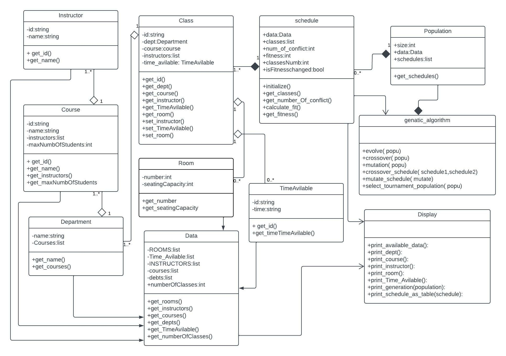
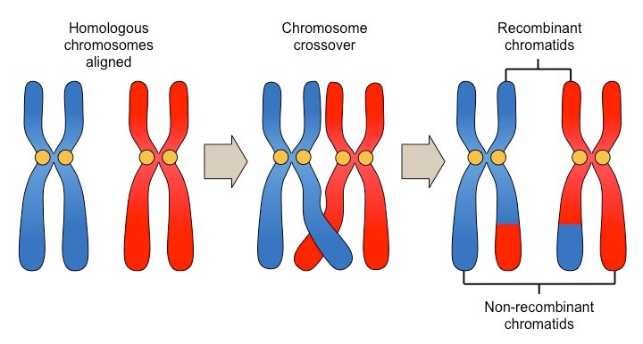
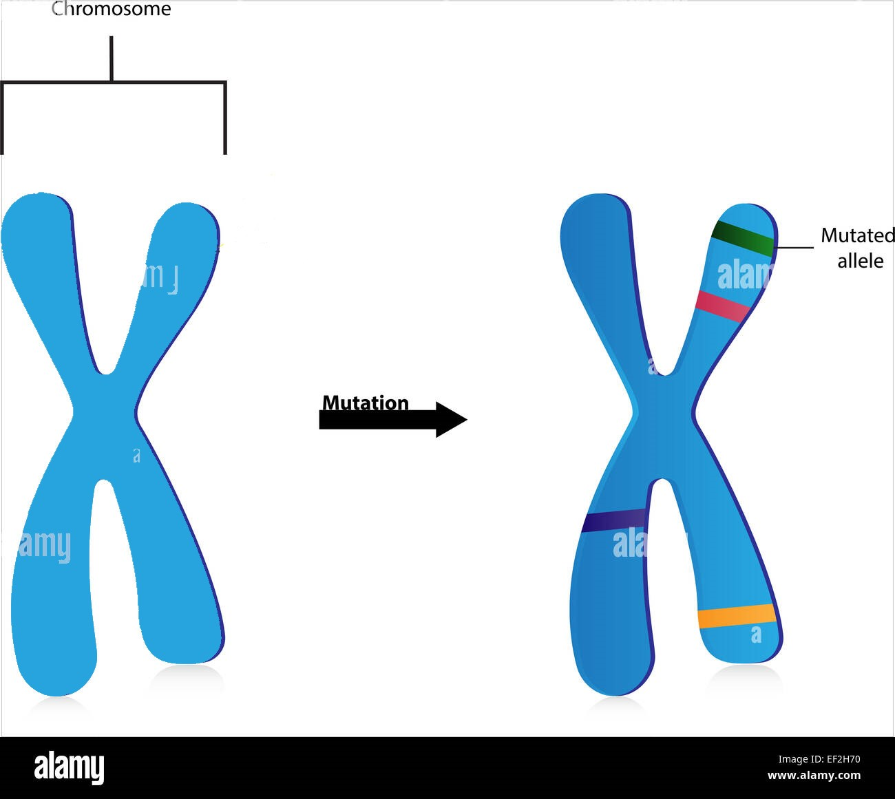
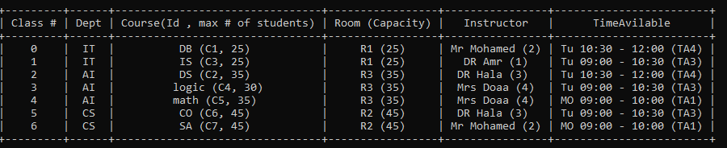

# Faculty time-table using genetic algorithm

### UML class Diagram

### Algorithm explanation
**genetic algorithm:** is a search heuristic that is inspired by the theory of natural evolution. it is used to solve complicated problems with a greater number of variables & possible outcomes/solutions.

**algorithm steps:**
    **1- initialize population**: build a random set of schedules from Population-class
    **2- select individuals for mating pool** :pick up two schedules to crossover them using crossover-function in genatic_algorithm-class
    **3- perform crossover** mixed up classes from picked up schedules to build new schedule using crossover_schedule-function in genatic_algorithm-class
    
    **4- perform Mutation** : mutation is unpredictable change that occurs in a chromosome(schedule) using mutate_schedule-function in genatic_algorithm-class  
    
    **5- insert offspring into the population** : insert or replace created and edited schedules into population
    **6- repeat** : repeat from 1 to 5 until fitness = 1 (no conflict in schedule)

    ## result table screenshot
    
